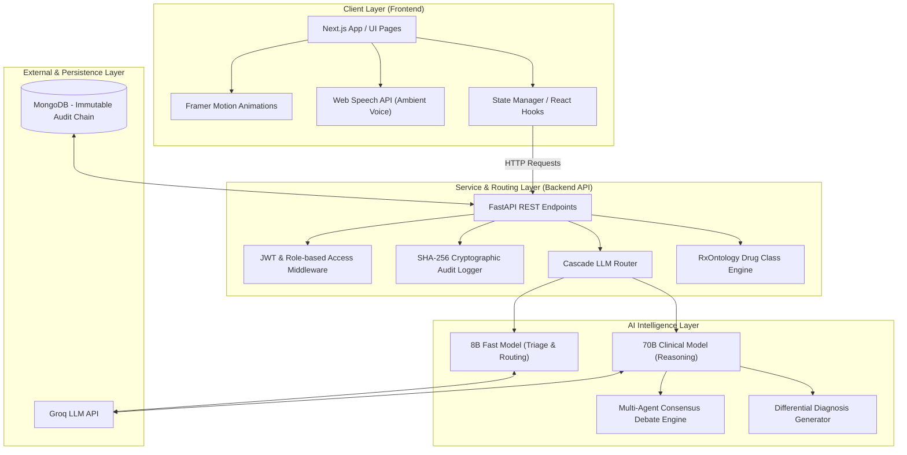
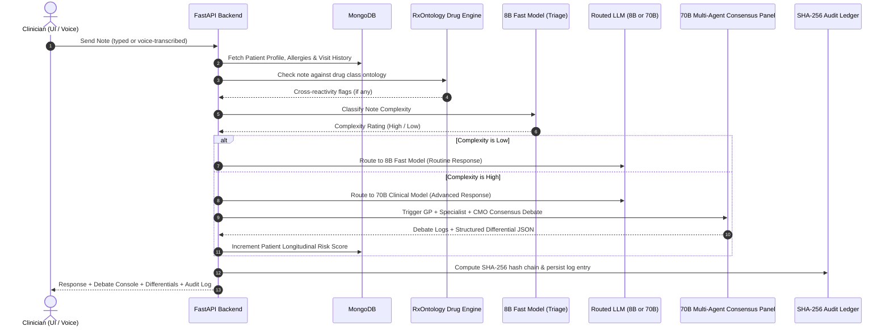

# CareThread — Clinical Intelligence Platform

> **A next-generation clinician-patient portal powered by multi-tier AI routing, pharmacological safety intelligence, ambient voice capture, cryptographic compliance, and a multi-agent expert consensus engine.**

---

## 🚀 Key Features

### Core Clinical Workspace
- **Practitioner Dashboard** — Roster view of assigned patients with longitudinal risk scores and active allergy/clinical warnings.
- **Pre-Visit Patient Briefing** — Structured pre-session summary of visit history, vitals, and open flags.
- **Automated SOAP Note Generation** — End-of-session structured Subjective, Objective, Assessment, and Plan documentation via the 70B clinical model.

### 🎙️ Ambient Speech-to-Text Engine *(NEW)*
Clinicians no longer type intake notes manually. Clicking the **microphone button** activates real-time ambient listening via the browser's native Web Speech API. Speech is transcribed live and streamed directly into the session input field, with an animated sound-wave indicator confirming active listening. Works in Chrome and Edge.

### ⚡ Cascade Triage Routing
Every clinician note is first evaluated by the **8B fast model** to classify complexity. Based on the verdict:
- **Low complexity** → Routed to the 8B model for a rapid routine response.
- **High complexity** → Escalated to the **70B clinical model** for advanced reasoning, triggering differential diagnosis generation and a risk score update.

A real-time **Cascade Audit Log** renders every routing decision, the model selected, reasoning, and cost in the live session workspace.

### 🧬 Pharmacological Cross-Reactivity Engine *(NEW)*
Allergy detection has been upgraded from basic string matching to a **drug class ontology** system. If a patient has an allergy to any drug in a pharmacological class, the system flags *any other drug in that class* as a cross-reactivity risk:

| Class | Covered Drugs |
|---|---|
| **NSAIDs** | Ibuprofen, Naproxen, Aspirin, Celecoxib, Diclofenac, Meloxicam |
| **Penicillins** | Penicillin, Amoxicillin, Ampicillin, Piperacillin, Augmentin |
| **Sulfonamides** | Bactrim, Sulfamethoxazole, Sulfasalazine |
| **Beta-Blockers** | Metoprolol, Atenolol, Propranolol, Carvedilol |

Alert example: *"⚠️ Pharmacological Cross-Reactivity Alert: Patient has a recorded allergy matching the Penicillin Class Antibiotics group. Prescribing Amoxicillin is contraindicated."*

### 🧠 Multi-Agent Clinical Consensus Debate Panel *(NEW)*
When a high-complexity case triggers differential diagnosis generation, the **70B model** runs a simulated expert consultation between three virtual agents before reaching a final diagnosis:

- 🟡 **Dr. Sarah Lin (General Practitioner)** — primary symptom analysis
- 🔵 **Dr. Marcus Vance (Specialist)** — deep-dive specialist perspective
- 🟣 **Dr. Helen Vance (Chief Medical Officer)** — moderates debate and drives consensus

The session workspace displays a dark-themed **Clinical Consultation Console** showing the live expert discussion, followed by the final differential diagnosis cards labeled **"70B Model Panel · Consensus Reached"**.

### 🔐 Cryptographically Verifiable HIPAA Ledger *(NEW)*
The HIPAA audit trail is no longer just a log — it is a **tamper-proof, cryptographically chained ledger**:

- Every audit entry stores its own **SHA-256 hash** and the hash of the previous entry, forming an immutable chain (Merkle-style).
- On startup, the backend automatically signs and chains any existing unhashed logs.
- The Admin Dashboard features a **"Verify Chain Integrity"** button that traverses all entries, recomputes hashes, and confirms whether the ledger has been tampered with.
- Each audit entry in the UI can be expanded to reveal its `previous_hash` and `hash` in a terminal-style display.
- Exported compliance `.txt` files include SHA-256 hash fields for every entry.

---

## 🛠️ Architecture & Tech Stack

### System Architecture



### Full Session Workflow



---

### Tech Stack

| Layer | Technology |
|---|---|
| **Frontend** | Next.js 16 (React 19, TypeScript), Tailwind CSS v4, Framer Motion, Lucide Icons |
| **Backend** | FastAPI (Python 3), JWT Auth & Encrypted Cookies |
| **Database** | MongoDB via `pymongo` / `motor` with partial indexes |
| **LLM Engine** | Groq Cloud API |
| **Triage / Fast Tier** | `llama-3.1-8b-instant` |
| **Clinical / Complex Tier** | `llama-3.3-70b-versatile` |
| **Voice Input** | Web Speech API (native browser, no third-party) |
| **Cryptography** | Python `hashlib` SHA-256 (built-in, no dependencies) |
| **Drug Safety** | Custom RxOntology class mapping engine (local, zero-latency) |

---

## ⚙️ Project Structure

```
CareThread/
├── frontend/                   # Next.js Application
│   ├── src/app/
│   │   ├── session/[patientId] # Live clinical session (voice + debate + audit)
│   │   ├── briefing/[patientId]# Pre-visit patient intelligence summary
│   │   ├── summary/            # Session conclusion & SOAP note overview
│   │   ├── admin/              # Cryptographic HIPAA audit trail & verification
│   │   └── page.tsx            # Entry Dashboard & Auth Portal
│   └── package.json
│
└── backend/                    # FastAPI Backend
    ├── database.py             # MongoDB collections & partial indexes
    ├── models.py               # MongoDB document schemas
    ├── auth.py                 # Security & JWT handling
    ├── llm_router.py           # Cascade routing + Multi-Agent Consensus engine
    ├── main.py                 # REST API routes, RxOntology engine, SHA-256 ledger
    ├── seed.py                 # Platform seed data generator
    └── requirements.txt        # Python dependencies
```

---

## 🏁 Getting Started

### Prerequisites
- Node.js (v18+)
- Python 3.10+
- A running MongoDB instance (local or MongoDB Atlas)
- Groq API Key (free tier works)

### Backend Setup

```bash
cd backend

# Create and activate a virtual environment
python -m venv venv
.\venv\Scripts\activate        # Windows
source venv/bin/activate       # macOS/Linux

# Install dependencies
pip install -r requirements.txt

# Create environment config
# backend/.env
MONGODB_URI=your_mongodb_connection_string
GROQ_API_KEY=your_groq_api_key

# Seed the database with demo patients & visit history
python seed.py

# Start the backend
uvicorn main:app --reload --port 8000
```

### Frontend Setup

```bash
cd frontend

npm install
npm run dev
```

Open [http://localhost:3000](http://localhost:3000) in **Chrome or Edge** (required for the Ambient Voice feature).

---

## 🔐 Demo Credentials

After running `seed.py`:

| Role | Email | Password |
|---|---|---|
| **Doctor** | `doctor@carethread.com` | `password123` |
| **Patient** | `priya@patient.com` | `password123` |
| **Patient** | `john@patient.com` | `password123` |
| **Patient** | `maria@patient.com` | `password123` |

---

## 🎬 Demo Script (3 Minutes to Wow)

1. Login as **`doctor@carethread.com`** → click a patient from the roster
2. Open the **Live Session** workspace
3. Click the 🔴 **mic button** → speak a clinical observation → watch text appear live
4. **Send** → observe the **Cascade Triage Audit Log** populate in real-time
5. Type `amoxicillin` (for a patient with Penicillin allergy) → see the **Cross-Reactivity Alert** fire
6. Send a complex multi-symptom note → watch the **Clinical Consultation Console** animate with 3 expert agents debating → final differentials appear below
7. Click **End Session** → navigate to the **Admin** dashboard
8. Click **"Verify Chain Integrity"** → observe the green **"Audit Trail Intact"** shield appear
9. Expand any audit log row → inspect the `prev:` and `hash:` SHA-256 fields

---

## 🏆 Technical Highlights for Evaluators

| Capability | Implementation |
|---|---|
| **Cost-aware AI routing** | 8B → 70B model cascade based on real-time complexity classification |
| **Zero-latency drug safety** | Local ontology map (no API call) with 4 pharmacological class families |
| **Immutable audit compliance** | SHA-256 hash chain stored in MongoDB, verified server-side on demand |
| **Multi-agent clinical AI** | 3-specialist debate panel baked into a single 70B model prompt, returning structured JSON |
| **Hands-free data entry** | Native Web Speech API with continuous transcription and interim result handling |
| **Real-time cost tracking** | Per-call token cost estimation displayed live in the session workspace |
