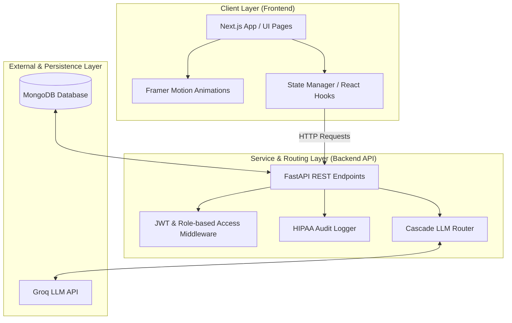
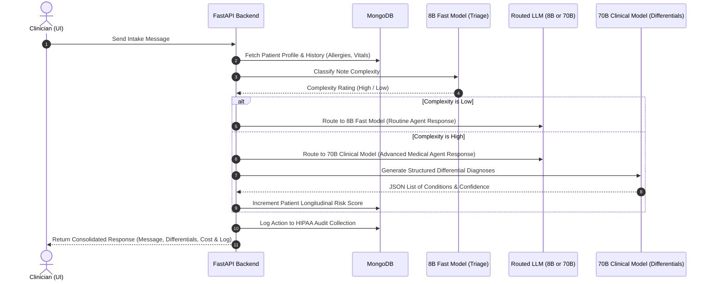

# CareThread Secure Platform

CareThread is a clinician-patient portal and clinical decision-support intelligence platform. It features real-time **Cascade Triage** routing, longitudinal patient memory tracking, live allergy conflict detection, automatic SOAP note generation, and clinical differential diagnosis suggestions.

---

## 🚀 Key Features

*   **Practitioner Dashboard**: Roster listing of assigned patients, longitudinal risk scores, and active clinical/allergy warnings.
*   **Safe Patient Portal**: Patient timelines, medical histories, and active medication/allergy alerts.
*   **Live Clinical Session Workspace**:
    *   **Cascade Triage Routing**: Automatically routes clinical notes between an **8B Fast model** (simple triage/queries) and a **70B Clinical model** (complex reasoning/differentials) depending on case complexity, tracking API cost optimization.
    *   **Live Audit Log**: Real-time logging of routed LLM tiers, reasoning, and cost estimates.
    *   **AI Differential Diagnoses**: Generates structured clinical differentials using the 70B model with confidence percentages and evidence.
    *   **Allergy Conflict Alerts**: Automatically parses clinical intakes for allergen references (e.g. Ibuprofen) and alerts clinicians against patient records.
*   **Automated SOAP Note Generation**: Formulates structured Subjective, Objective, Assessment, and Plan documentation at the end of sessions.
*   **Audit Trail & Security**: Built with FastAPI endpoints logging HIPAA audit actions.

---

## 🛠️ Architecture & Tech Stack

### System Architecture Layers
The platform follows a classic decoupled Client-Server architecture separated into distinct layers:



### Cascade Routing Workflow Diagram
When a clinician sends a note during a live session, CareThread runs it through an intelligent cascade mechanism to balance cost and accuracy:



---

### Tech Stack Details
* **Frontend**: Next.js 16 (React 19, TypeScript), Tailwind CSS v4, Framer Motion, Lucide Icons (Port `3000`)
* **Backend**: FastAPI (Python 3), JWT Authentication & Encrypted Cookies (Port `8000`)
* **Database**: MongoDB (via `pymongo` / `motor`) utilizing Partial Indexes to optimize conditional unique properties (e.g. `user_id`)
* **LLM Engine**: Groq Cloud API
  - **Triage/Fast Tier**: `llama-3.1-8b-instant`
  - **Complex/Clinical Tier**: `llama-3.3-70b-versatile`

---

## ⚙️ Project Structure

```
CareThread/
├── frontend/                  # Next.js Application
│   ├── src/app/
│   │   ├── session/[patientId]# Live clinical conversation
│   │   ├── briefing/[patientId]# Pre-visit patient intelligence summary
│   │   ├── summary/           # Session conclusion & SOAP overview
│   │   ├── admin/             # HIPAA audit trail list
│   │   └── page.tsx           # Entry Dashboard & Auth Portal
│   └── package.json           # Frontend configuration
│
└── backend/                   # FastAPI Backend
    ├── database.py            # MongoDB collections initialization & partial indexes
    ├── models.py              # MongoDB document schemas
    ├── auth.py                # Security & JWT handling
    ├── llm_router.py          # Groq integration & Cascade routing logic
    ├── main.py                # REST API routes
    ├── seed.py                # Platform seed data generator
    └── requirements.txt       # Python dependencies
```

---

## 🏁 Getting Started

### Prerequisites
- Node.js (v18+)
- Python 3.10+
- A running MongoDB Database (Local or MongoDB Atlas)
- Groq API Key

### Backend Setup
1. Navigate to the backend directory:
   ```bash
   cd backend
   ```
2. Create and activate a virtual environment:
   ```bash
   python -m venv venv
   # Windows:
   .\venv\Scripts\activate
   # macOS/Linux:
   source venv/bin/activate
   ```
3. Install dependencies:
   ```bash
   pip install -r requirements.txt
   ```
4. Create a `.env` file in the `backend/` directory:
   ```env
   MONGODB_URI=your_mongodb_connection_string
   GROQ_API_KEY=your_groq_api_key
   ```
5. Seed the database with demo patient roster & history data:
   ```bash
   python seed.py
   ```
6. Run the FastAPI development server:
   ```bash
   uvicorn main:app --reload --port 8000
   ```

### Frontend Setup
1. Navigate to the frontend directory:
   ```bash
   cd ../frontend
   ```
2. Install the packages:
   ```bash
   npm install
   ```
3. Launch the development application:
   ```bash
   npm run dev
   ```
4. Open [http://localhost:3000](http://localhost:3000) in your web browser.

---

## 🔐 Credentials for Seeding Testing
After running `seed.py`, you can test authentication with these credentials:
* **Doctor Profile**: `doctor@carethread.com` (Password: `password123`)
* **Patient Profiles**: `priya@patient.com`, `john@patient.com`, `maria@patient.com` (Password: `password123`)
